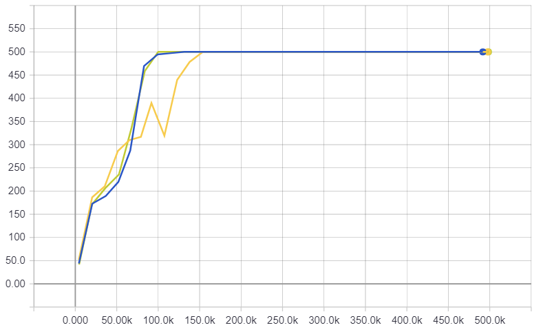
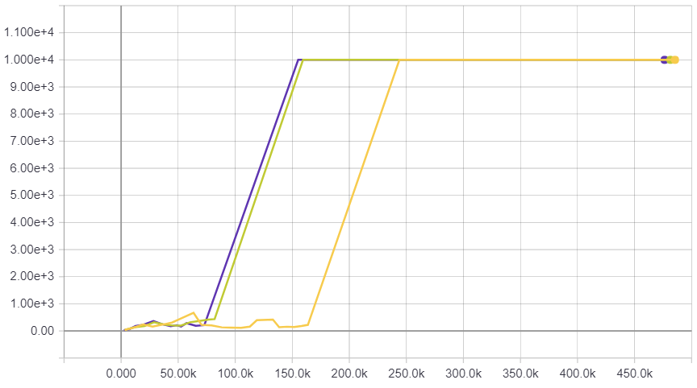
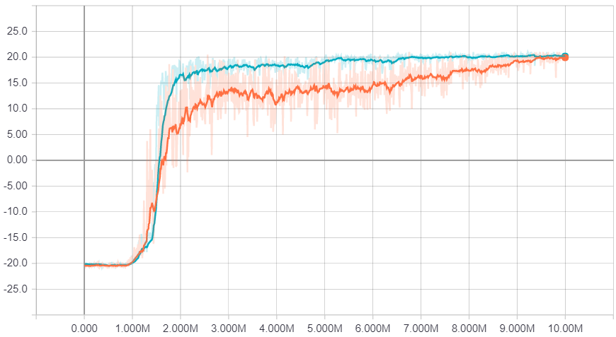
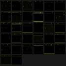
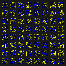
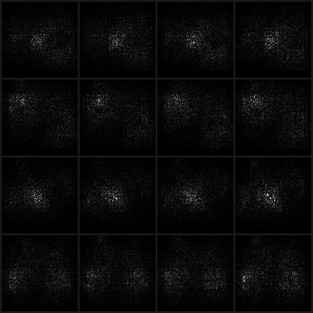
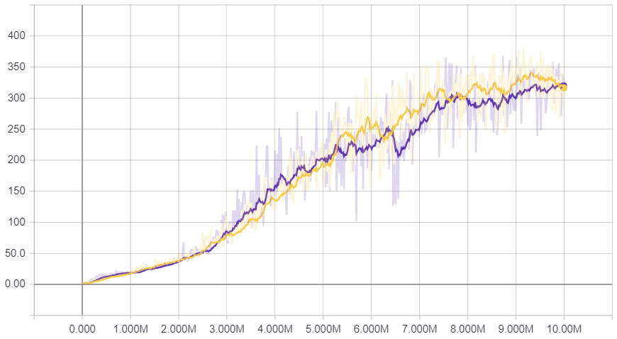
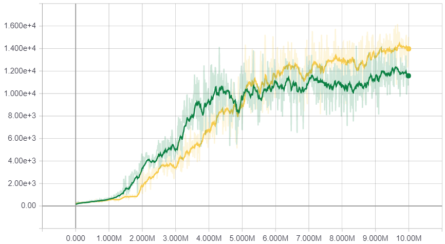
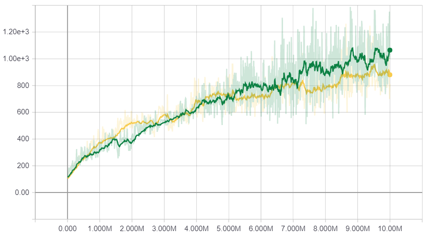
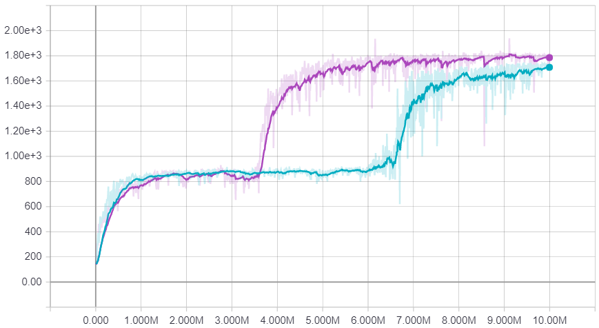

# Proximal Policy Optimization in PyTorch

## New gym environments

When library imported following gym environments are registered:

Continuous versions of Acrobot and CartPole `AcrobotContinuous-v1`, `CartPoleContinuous-v0`, `CartPoleContinuous-v1`

CartPole with 10000 steps limit `CartPoleContinuous-v2`, `CartPole-v2`

## Training

Training code does not print any information to console, only available output is TensorBoard logs.

#### Classic control
`CartPole-v1` for 500K steps without CUDA (`--force-cuda` to enable it, won't improve performance)

`python main.py --env-name CartPole-v1 --tensorboard-path /tensorboard/output/path`

#### Atari
`PongNoFrameskip-v4` for 3M steps (12M emulator frames)

`python main.py --atari --env-name PongNoFrameskip-v4 --steps 3000000 --tensorboard-path /tensorboard/output/path`

## Results

#### CartPole-v1

#### CartPoleContinuous-v2

#### PongNoFrameskip-v4

#### BreakoutNoFrameskip-v4

#### QbertNoFrameskip-v4

#### SpaceInvadersNoFrameskip-v4

#### SeaquestNoFrameskip-v4
